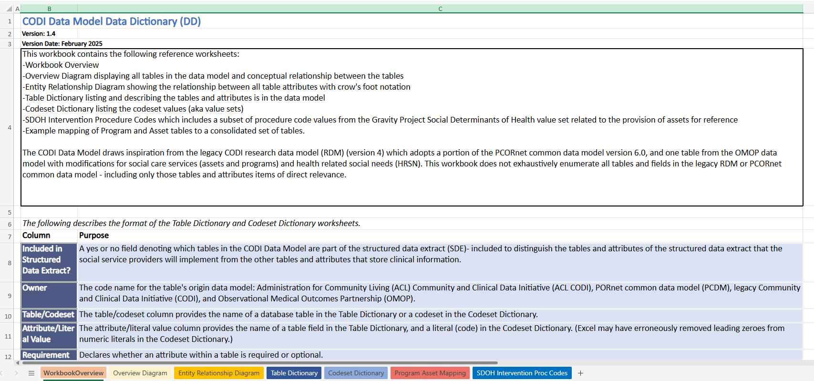

---

---

# Data Model Dictionary

The [Data Model Data Dictionary](../../../../codi-resources/CODI%20Data%20Model%20Data%20Dictionary_v1.4_20250212.xlsx) (DD) is an Excel workbook that describes 25 tables that compose the CODI Data Model and defines table and attribute names, formats, and standard code sets. This workbook serves as a reference guide for understanding the structure, relationships, and attributes of the data needed for the CODI Data Model. Implementers may use this resource to understand the contents of the CODI Data Model and what data about programs, services, and social needs can be exchanged.  

    

    [Data Model Data Dictionary](../../../../codi-resources/CODI%20Data%20Model%20Data%20Dictionary_v1.4_20250212.xlsx) (DD)

