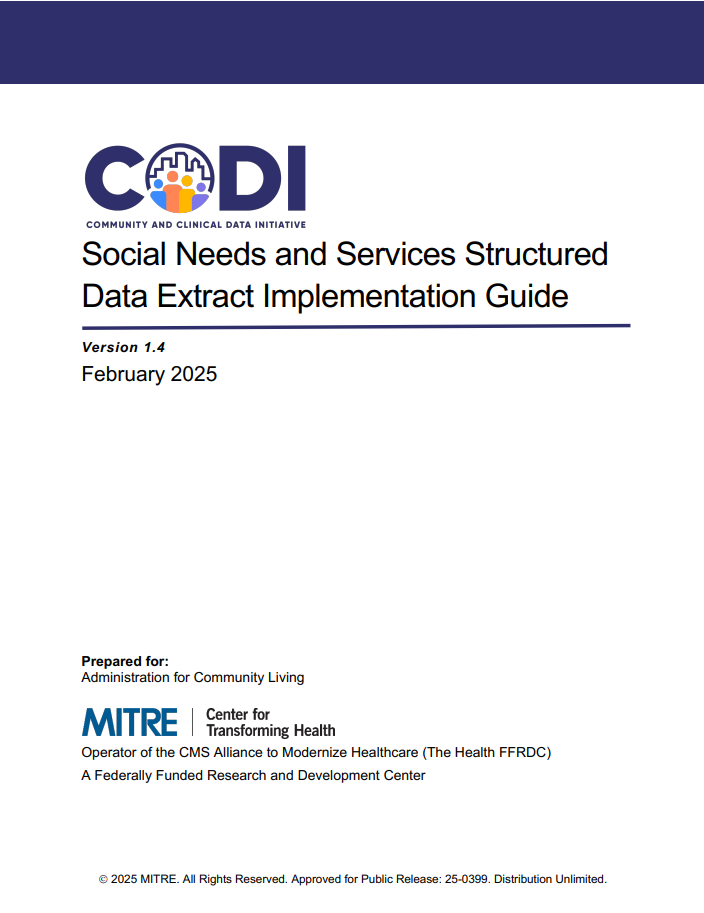

---

---

# Data Model Implementation Guide

The [Data Model Implementation Guide](../../../../codi-resources/CODI_Data_Model_Implementation_Guide_v1.4.pdf) is a document that provides an overview of the CODI Data Model and the Structured Data Extract (SDE). The SDE is a subset of the CODI Data Model that CBOs can use to store data about programs and services. Detailed implementation guidance is provided for each of the 12 SDE tables. Implementers may use this resource to generate a SDE from one or multiple source information systems.  

    
    

    [Data Model Implementation Guide](../../../../codi-resources/CODI_Data_Model_Implementation_Guide_v1.4.pdf)

