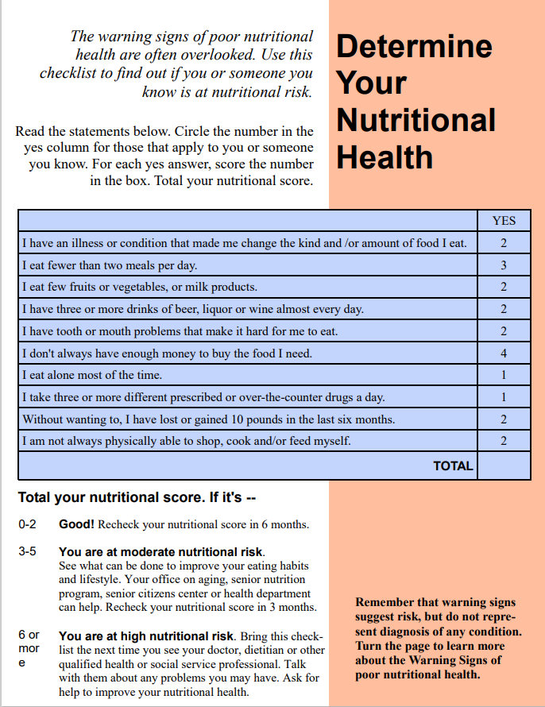

---

---

# DETERMINE Your Nutritional Risk Checklist formatted as a FHIR Questionnaire

The [DETERMINE Your Nutritional Risk Checklist](../../../../codi-resources/Determine-Your-Nutritional-Health.R4.json) is a brief risk-appraisal questionnaire to detect nutritional risk in older adults. This resource is a FHIR version (based on the FHIR Structured Data Capture profile) of the checklist that implementers may use to collect nutrition risk data electronically and transmit in standardized and interoperable format. To preview the questionnaire, upload the file to: [NLM Form Builder](https://formbuilder.nlm.nih.gov).

[DETERMINE Your Nutritional Risk Checklist formatted as a FHIR Questionnaire](../../../../codi-resources/Determine-Your-Nutritional-Health.R4.json)

