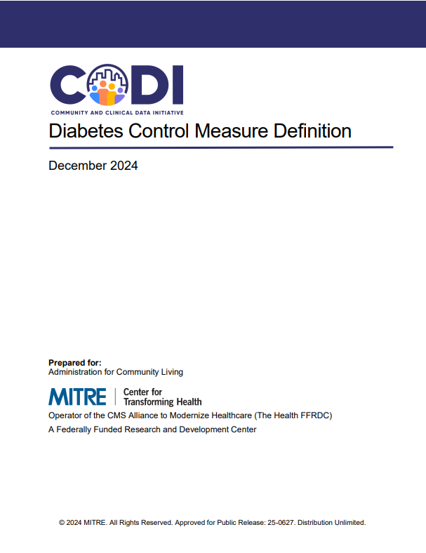

---

---

# Diabetes Control Measure Definitions

The Diabetes Control Measure Definition document defines how diabetes control should be assessed among a general population and within populations that received an intervention, which includes social services and programs. Implementers may use this resource to build a diabetes control measure using clinical data.  

 

[Diabetes Control Measure Definition](../../../../codi-resources/CODI_Diabetes_Control_Measure_Definition.pdf)

