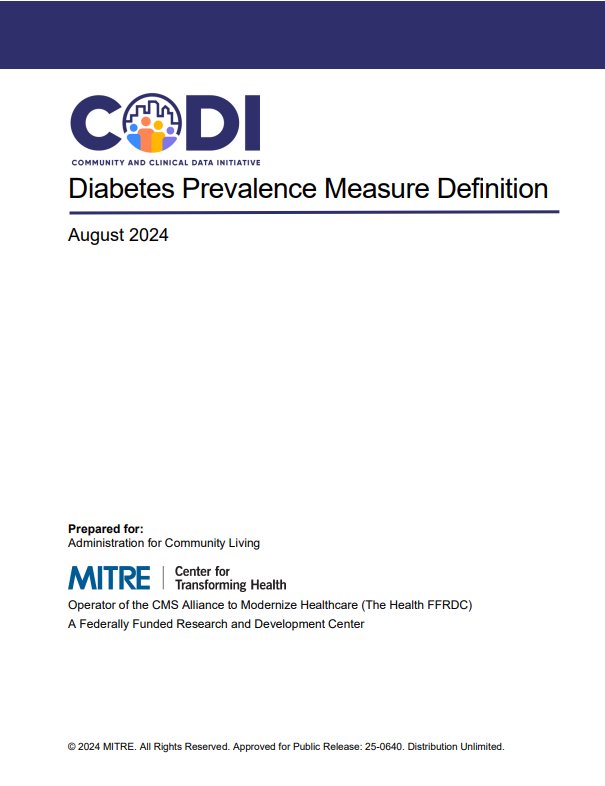

---

---

# Diabetes Prevalence Measure Definitions

The [Diabetes Prevalence Measure
Definition](../../../../codi-resources/CODI_Diabetes_Prevalence_Measure_Definition.pdf)
document defines how diabetes prevalence should be assessed using
clinical data shared by a healthcare provider with an HIE. Implementers
may use this resource to build a diabetes prevalence measure using
clinical data.

  

    
  

  [Diabetes Prevalence Measure
  Definition](../../../../codi-resources/CODI_Diabetes_Prevalence_Measure_Definition.pdf)

