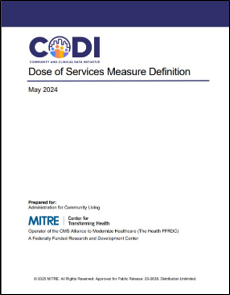

---

---

# Dose of Services Measure Definition

The [Dose of Services Measure Definition](../../../../codi-resources/CODI_Dose_of_Services_Measure_Definition_20250725.pdf) document describes a method for measuring the amount of services that an individual receives or consumes (i.e., dose of services) to address an identified need (e.g., meals to address food insecurity). Implementers may use this resource to build a dose of services measure using data from community settings. 

    
   
    [Dose of Services Measure Definition](../../../../codi-resources/CODI_Dose_of_Services_Measure_Definition_20250725.pdf)

