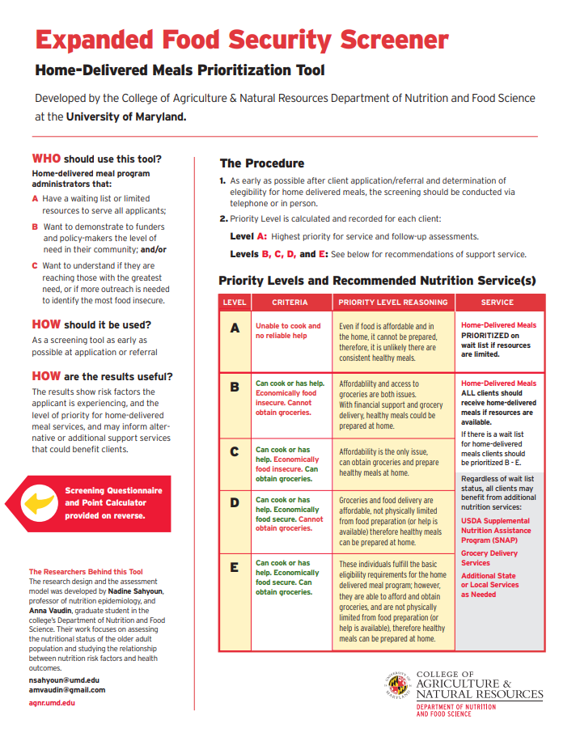

---

---

# Expanded Food Security Screener FHIR-formatted Questionnaire

The [Expanded Food Security Screener (FSS-Exp) FHIR-formatted Questionnaire](../../../../codi-resources/Expanded-Food-Security-Screener-by-the-University-of-Maryland.R4.json) is a FHIR version of the FSS-Exp based on the FHIR Structured Data Capture profile. Implementers may use this resource to collect food security data electronically and transmit it in a standardized and interoperable format. The [FSS-Exp](https://nfsc.umd.edu/extension/expanded-food-security-screener/) is a validated tool used to assess food security based on questions that ask about ability to afford food. To preview the questionnaire, upload the file to: [NLM Form Builder](https://formbuilder.nlm.nih.gov).

[Expanded Food Security Screener FHIR-formatted Questionnaire](../../../../codi-resources/Expanded-Food-Security-Screener-by-the-University-of-Maryland.R4.json)

