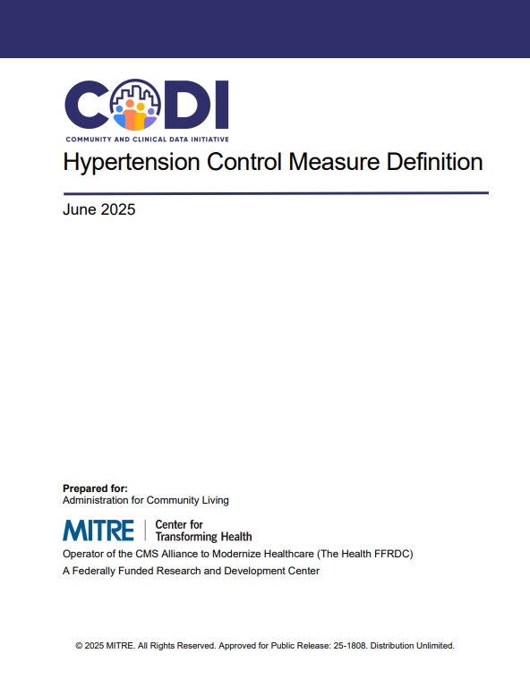

---

---

# Hypertension Control Measure Definitions

The [Hypertension Control Measure
Definition](../../../../codi-resources/CODI_Hypertension_Control_Measure_Definition_20250825.pdf)
document defines how hypertension control should be assessed among a general
population and within populations that received an intervention, like services
and programs provided by a community-based organization. Implementers may use
this resource to build a hypertension control measure using clinical data and
data provided by community-based organizations.

[Hypertension Control Measure Definition](../../../../codi-resources/CODI_Hypertension_Control_Measure_Definition_20250825.pdf)

