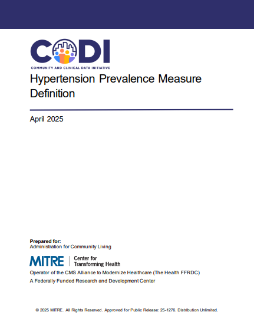

---

---

# Hypertension Prevalence Measure Definition

The [Hypertension Prevalence Measure
Definition](../../../../codi-resources/CODI_Hypertension_Prevalence_Measure_Definition_20250825.pdf)
document defines how hypertension prevalence should be assessed using clinical data shared by a healthcare provider with an HIE. Implementers may use this resource to build a hypertension prevalence measure using clinical data.

    

[Hypertension Prevalence Measure Definition](../../../../codi-resources/CODI_Hypertension_Prevalence_Measure_Definition_20250825.pdf)

