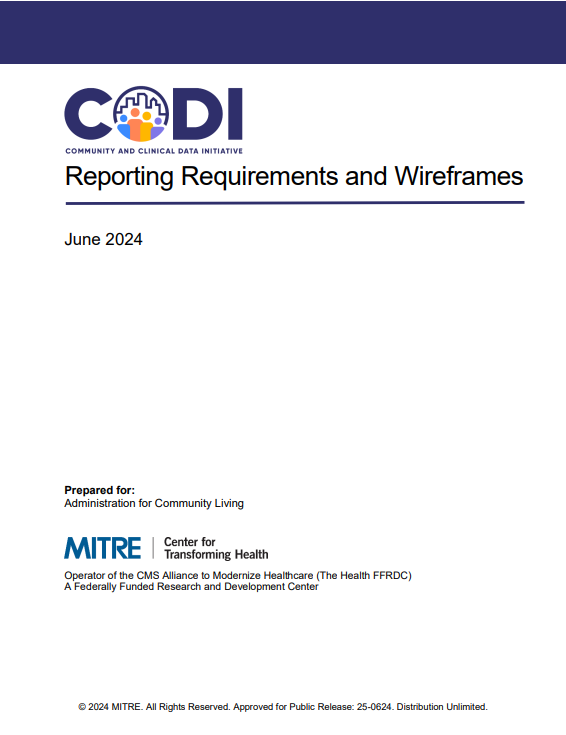

---

---

# Reporting Tool Wireframe Requirements

The [Reporting Tool Wireframes and Requirements](../../../../codi-resources/CODI%20Reporting%20Requirements%20and%20Wireframes.pdf) document shares the requirements and wireframes for two dashboards: 

* Service dashboard, which allows CBO users to view the amount of services delivered 
* Outcomes dashboard, which allows CBO users to assess clinical outcomes among those individuals receiving services from the user’s organization  

Requirements are a list of statements defining what the tool should do while wireframes are a visual representation of how the tool could be designed. Implementers may use this resource to guide the development of one or both dashboards.  

     

    [Reporting Tool Wireframes and Requirements](../../../../codi-resources/CODI%20Reporting%20Requirements%20and%20Wireframes.pdf)

