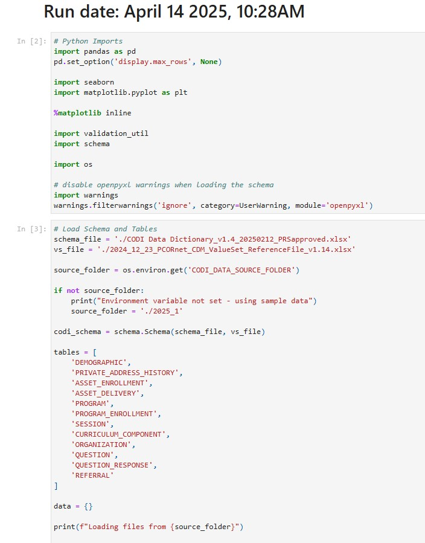

---

---

# Structured Data Extract Quality Assurance Script

The [Structured Data Extract Quality Assurance Script](https://github.com/mitre/data_model_validation) is a tool to check an SDE file’s conformance to the CODI Data Model SDE specification, verify referential integrity between tables, and to detect potential data quality issues by examining trends, table volume, and table contents. Implementers can use this script to evaluate if they have applied the CODI Data Model to their social care data correctly. The SDE Quality Assurance Script is written in Python and generates output that is presented in a Jupyter notebook with interpretation guidance for the user.

  

    
  

    [Structured Data Extract Quality Assurance Script](https://github.com/mitre/data_model_validation)

    

    [Structured Data Extract Quality Assurance Script Example Output](../../../../codi-resources/CODI_SDE_QA_script_example_output_20250422.pdf)

