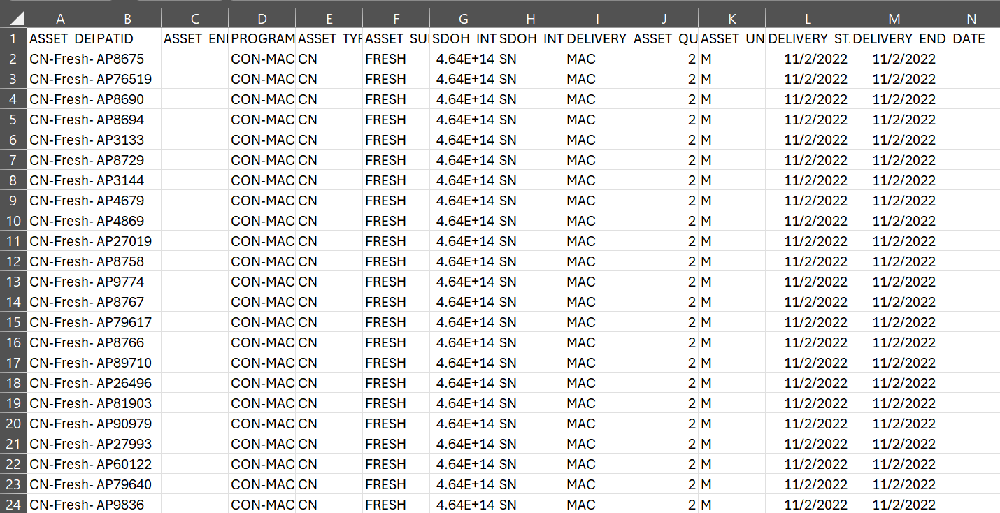

---

---

# Structured Data Extract Sample Data #1: Nutrition and Care Transition Programs

This example SDE file can help implementers review the contents and
structure of real world data from a CBO in the SDE format, test the
Data Model Quality Assurance Script, and/or test the Dose of Services
Measure Definition. [This example SDE
](https://github.com/mitre/codi/tree/main/codi-resources/sde-mac-anonymized)
includes data from three programs and services: a home-delivered
meals service, a congregate meals program, and a care-transitions
program. Nine SDE tables and corresponding CSV files are included:
ASSET_DELIVERY, ASSET_ENROLLMENT, CURRICULUM_COMPONENT, DEMOGRAPHIC,
ORGANIZATION, PRIVATE_ADDRESS_HISTORY, PROGRAM_ENROLLMENT, PROGRAM,
and SESSION. Individuals and their data have been anonymized in
these files to prevent reidentification.

  

    
  

  [Structured Data Extract Sample Data #1:
    Nutrition and Care Transition Programs](https://github.com/mitre/codi/tree/main/codi-resources/sde-mac-anonymized)

