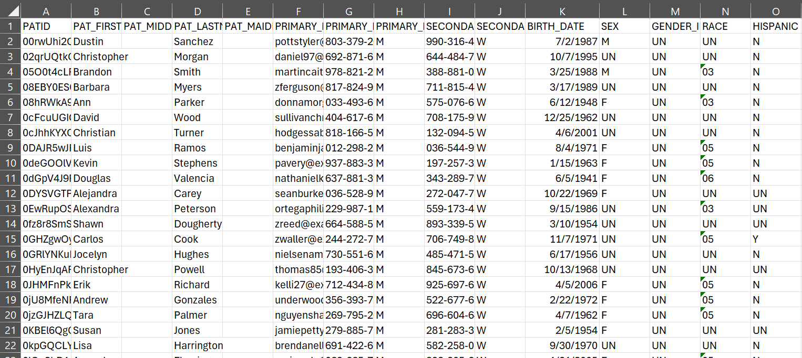

---

---

# Structured Data Extract Sample Data #2: Evidenced-Based Programs

[Example SDE files](https://github.com/mitre/codi/tree/main/codi-resources/sde-ww-anonymized) can help implementers review the contents and structure of a real world social care data in the SDE format, test the Data Model Quality Assurance Script, and/or test the Dose of Services Measure Definition. This example SDE includes four evidence-based programs: falls prevention, diabetes self-management education, chronic disease self-management, and chronic pain self-management. Five SDE tables and corresponding CSV files are included:  DEMOGRAPHIC, ORGANIZATION, PRIVATE_ADDRESS_HISTORY, PROGRAM, and PROGRAM_ENROLLMENT. Individuals and their data have been anonymized in these files to prevent reidentification.

    

    [Structured Data Extract Sample Data #2: Evidenced-Based Programs](https://github.com/mitre/codi/tree/main/codi-resources/sde-ww-anonymized)

