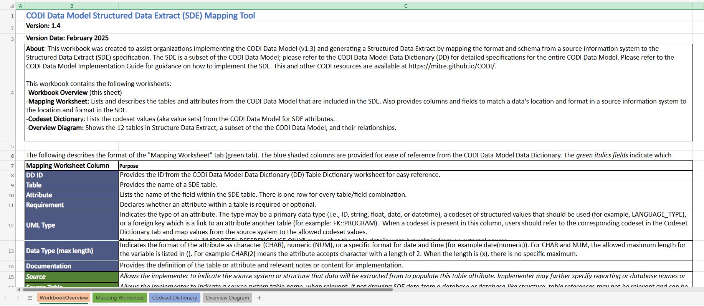

---

---

# Structured Data Extract Mapping Tool

The [Structured Data Extract Mapping Tool](../../../../codi-resources/SDE%20Mapping%20Tool%20v1.4%2020250428.xlsx) is an Excel workbook that CBOs can use to map data from their source information systems to the SDE. Implementers may use this resource to support their SDE mapping efforts and preserve information about where data was drawn from and how it was transformed.

    

    [Structured Data Extract Mapping Tool](../../../../codi-resources/SDE%20Mapping%20Tool%20v1.4%2020250428.xlsx)

