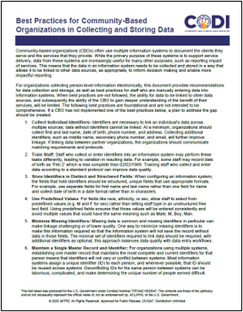

---

---

# Best Practices for Community-Based Organizations in Collecting and Storing Data 

The [Best Practices for Community-Based Organizations in Collecting and Storing Data](../../../../codi-resources/Data_Best_Practices_for_CBOs_20250321.pdf) document provides recommendations for data collection and storage for CBOs collecting person-level information electronically, as well as best practices for staff who are manually entering data into information systems.

    
   
    [Best Practices for Community-Based Organizations (CBOs)](../../../../codi-resources/Data_Best_Practices_for_CBOs_20250321.pdf)

