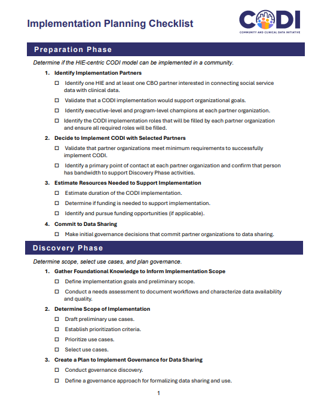

---

---

# Connecting Data to Improve Health: CODI Implementation Playbook for Communities with an HIE

The purpose of this playbook is to support communities interested in connecting
data from community settings (e.g., data about community-based programs and
services that address needs like food insecurity, transportation, and housing)
with clinical data from healthcare providers. The CODI HIE-centric Model helps
communities leverage the capabilities of a HIE, including its existing
infrastructure and governance to connect clinical and community data. This
playbook can be used to support planning a CODI HIE-centric Model
Implementation.

    

    
    

    [CODI Playbook](../../../../codi-resources/CODI_Implementation_Playbook_20250815.pdf)

    

    
    

    [Implementation Checklist](../../../../codi-resources/CODI_Planning_Checklist.pdf)

