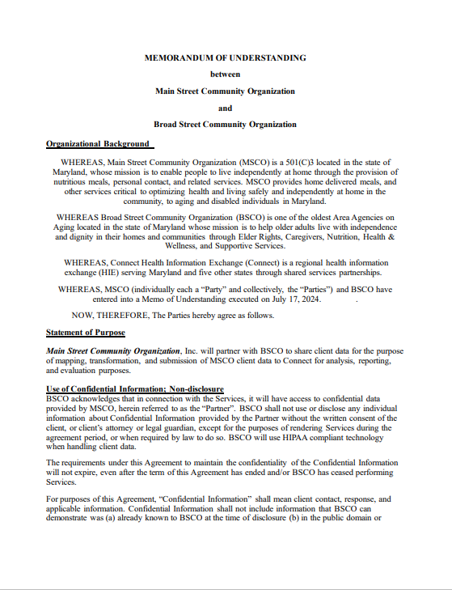

---

---

# Example Memorandum of Understanding for Data Sharing

The [Example Memorandum of
Understanding for Data
Sharing](../../../../codi-resources/Example_Data_Sharing_MOU_20250422.docx)
agreement provides a template for CBOs who want to exchange data
with other CBOs for various purposes. This agreement can formalize
a data sharing relationship and codify the expectations of the
sending and receiving organizations. During the CODI implementation
in Maryland, this agreement facilitated sharing data between two
CBOs to support data transformation into the CODI structured data
extract (SDE) format.

  

    
  

    [Example Memorandum of Understanding for Data Sharing](../../../../codi-resources/Example_Data_Sharing_MOU_20250422.docx)

