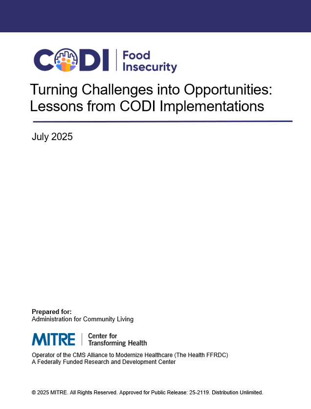

---

---

# Turning Challenges into Opportunities: Lessons from CODI Implementations

[Turning Challenges into Opportunities:
Lessons from CODI
Implementations](../../../../codi-resources/CODI_Lessons_Learned_FINAL_20250808.pdf)
is a document that describes key learnings from the Maryland CODI
implementation with the objective of helping future CODI implementations
improve efficiency and effectiveness. These lessons highlight what
worked well, what didn't, and what could be improved in the future.
This document can be used by individuals and organizations considering,
planning, or executing a CODI implementation in their community.
Lessons learned are most useful if applied during project planning
but can be valuable at any point in the project lifecycle.

    

    
    

    [Turning Challenges into
    Opportunities: Lessons from CODI
    Implementations](../../../../codi-resources/CODI_Lessons_Learned_FINAL_20250808.pdf)

