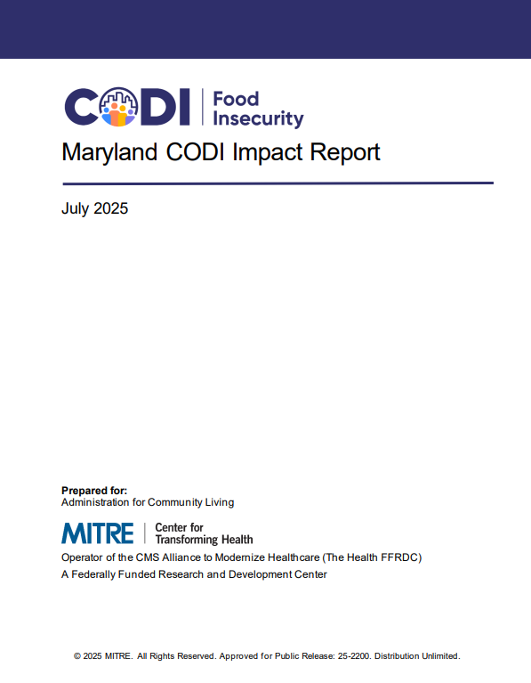
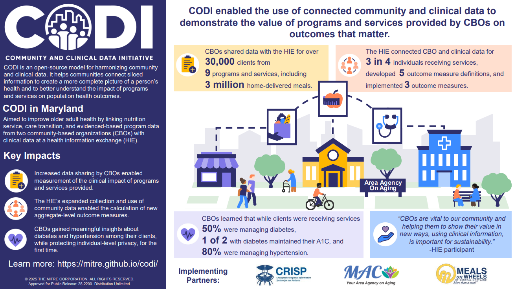

---

---

# Maryland CODI Impact Report

The [Maryland CODI Impact
Report](../../../../codi-resources/CODI_Maryland_Impact_Report_20250811.pdf)
summarizes how organizations participating in the Maryland implementation were
directly impacted and describes the likely future value that will result due to
the continuation of this work beyond the implementation phase. This report may
be used to provide an example of the types of impact that partners can expect
following a CODI implementation.

    

      
    

    [Maryland CODI Impact
    Report](../../../../codi-resources/CODI_Maryland_Impact_Report_20250811.pdf)

    

      
    

    [Maryland CODI Impact
    Summary](../../../../codi-resources/CODI_Maryland_Impact_Summary_Final.pdf)

