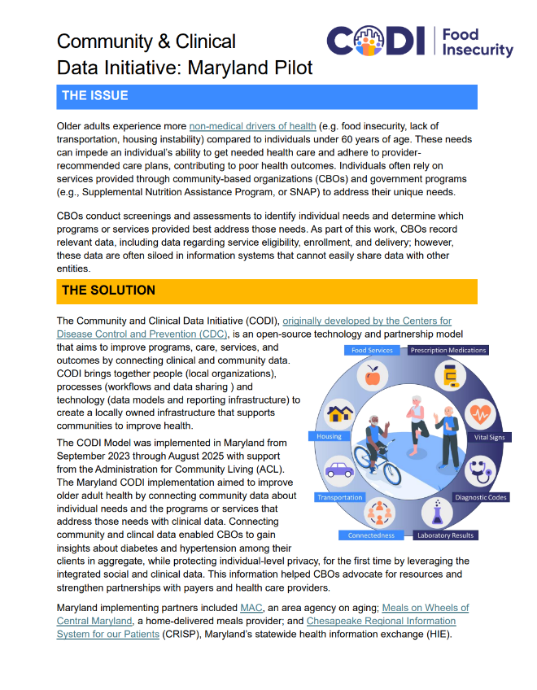

---

---

# Maryland Pilot Overview Fact Sheet

The [Maryland Pilot Overview Fact
Sheet](../../../../codi-resources/CODI_Maryland_Fact_Sheet_8.7.25.pdf)
is an educational resource that describes the issue addressed by
the CODI model, and a high-level description of the CODI implementation
in Maryland, including the HIE-centric approach. Implementers may
use this fact sheet to engage potential partners in early discussions
about implementing CODI to address similar needs.

    

    
    

    [Maryland Pilot Overview Fact
    Sheet](../../../../codi-resources/CODI_Maryland_Fact_Sheet_8.7.25.pdf)

