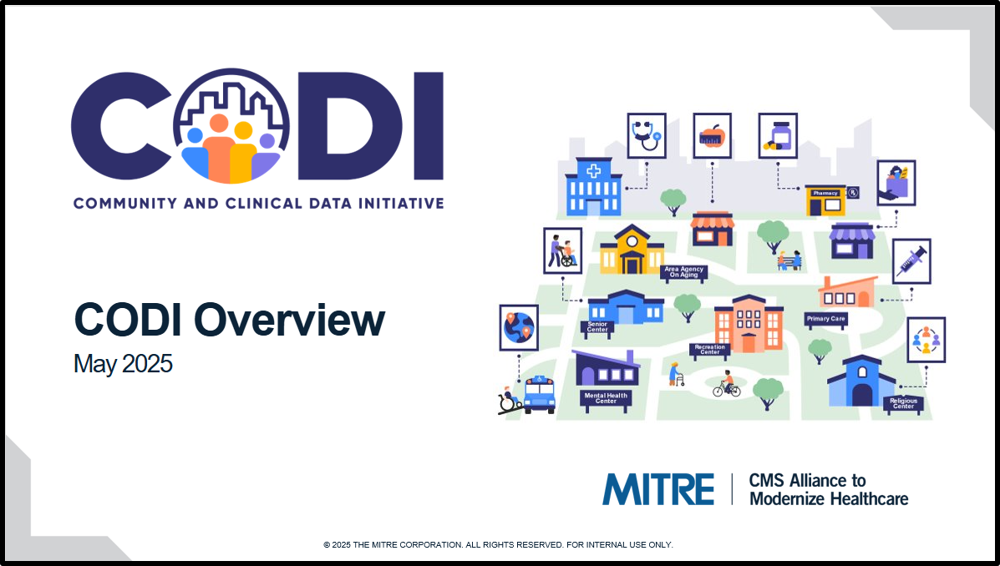

---

---

# CODI Model Overview Briefing

The [CODI Model Overview
Briefing](../../../../codi-resources/CODI_Model_Overview_Briefing_20250807.pdf)
is a communication resource that introduces the CODI model, reviews CODI model
implementations and technical approaches, describes CODI resources, outlines the
implementation of the HIE-centric approach, and discusses the enduring value of
a CODI implementation. Organizations interested in CODI may use these slides to
engage their leadership and secure buy-in for participating in a CODI
implementation, and implementers may use this resource to engage potential
partners in early discussions about implementing CODI or to describe an ongoing
implementation.

    

    [CODI Model Overview
    Briefing](../../../../codi-resources/CODI_Model_Overview_Briefing_20250807.pdf)

