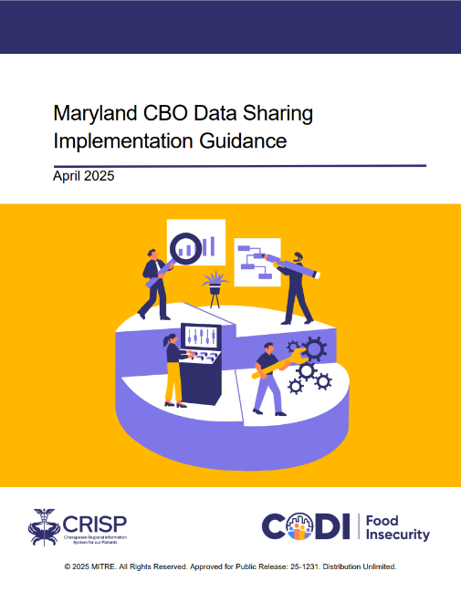
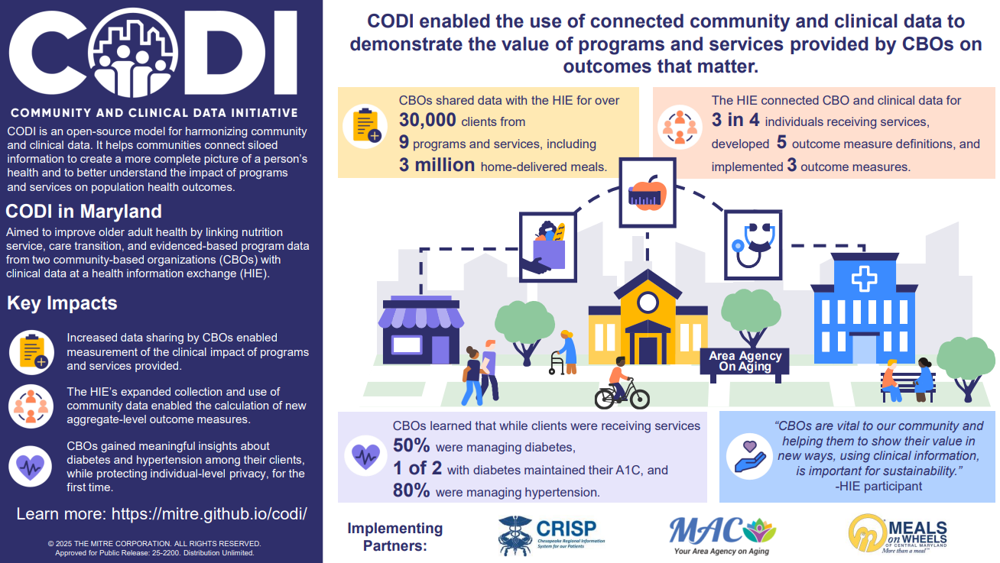

---

---

# Food Insecurity in Maryland

From 2023-2025, CODI was implemented in Maryland (CODI@MD) working with MAC,
Inc., an area agency on aging; Meals on Wheels of Central Maryland (MOWCM); and
Chesapeake Regional Information System for our Patients (CRISP), Maryland’s
statewide health information exchange. This implementation focused on older
adults, nutrition programs that address food insecurity, and related clinical
outcome measures. As part of this implementation, data about evidence-based
programs and care-transitions were also exchanged . CODI@MD linked clinical
and community data in the Eastern Shore and greater Baltimore areas to enable
MAC and MOWCM to better understand the impact of their nutrition programs and services. 

This implementation was supported by the Administration for Community Living
(ACL) from 2023-2025. The technical approach for this implementation is
described on this GitHub site.

## Outputs

The following resources contain information specific to the Maryland CODI
implementation. Visit the resource pages to learn more.

<table className="blue-links">
    <tr>
        <td></td>
        <td></td>
        <td></td>
        <td></td>
    </tr>
    <tr>
        <td>[Maryland Community-Based Organization Data Sharing Implementation Guidance](../codi-resources-by-phase/preparation-discovery-and-planning/md-cbo-data-sharing-implementation-guidance)</td>
        <td>[Maryland CODI Impact Report](../codi-resources-by-phase/preparation-discovery-and-planning/md-codi-impact-report)</td>
        <td>[Turning Challenges into Opportunities: Lessons from CODI Implementations](../codi-resources-by-phase/preparation-discovery-and-planning/lessons-from-codi-implementations)</td>
        <td>[Maryland Pilot Overview Fact Sheet](../codi-resources-by-phase/preparation-discovery-and-planning/md-overview-fact-sheet)</td>
    </tr>
</table>
